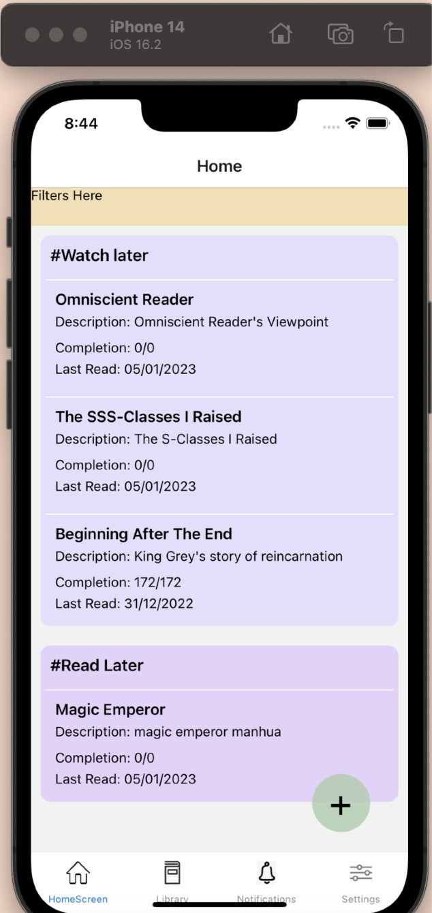

# Comic Tracker

## Following features will be added in future(maybe)

-   Add, edit, remove comics from different types like Read Later, completed, etc
-   UI updates
-   HomeScreen filters
-   Share your custom list (ex: Must read, good, etc) to other users in real-time with notifications
    -   Receivers will be able to see all custom list shared.
-   User Profile section with name and other details
-   Settings tab and library tab
-   _Hosting server (currently NOT hosted)_

And I think thats all. Feel free to reach out to me or our contributors to participate or give new ideas.

## BETA App screenshot

 

###  ⚠️ NOTICE: This project is currently under development plus I am not good at UI 😅.
